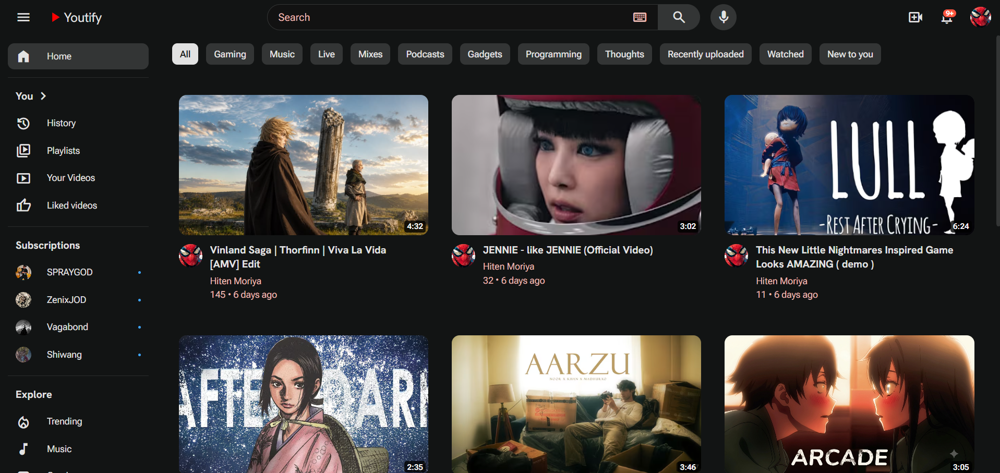
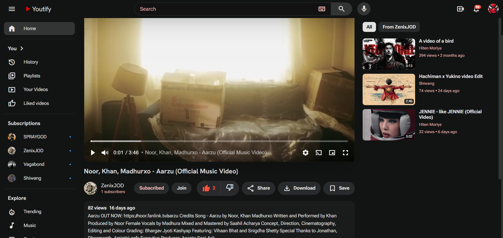
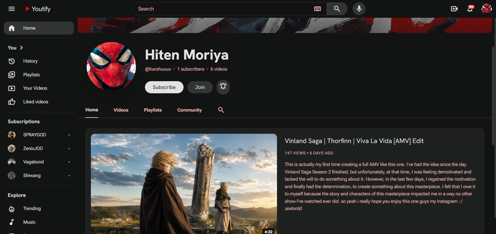
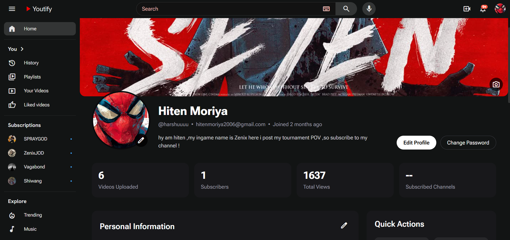
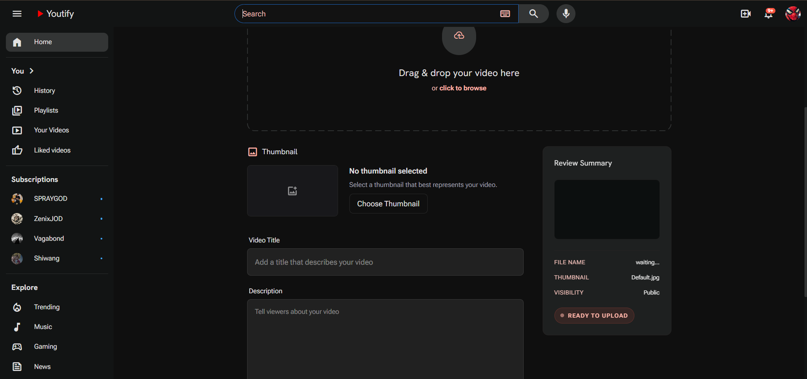
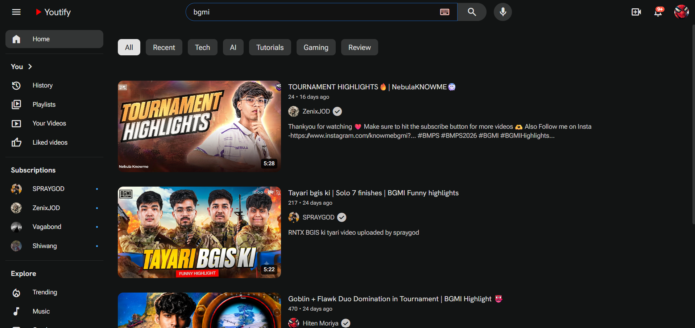
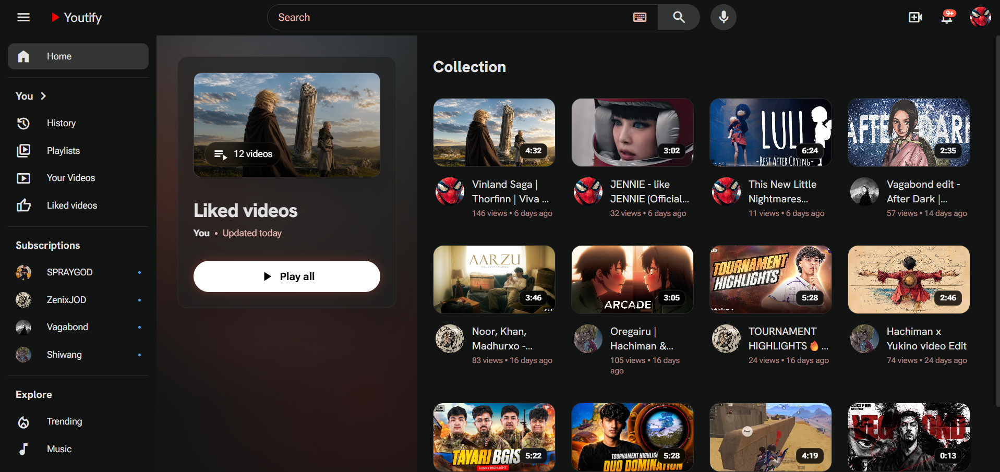
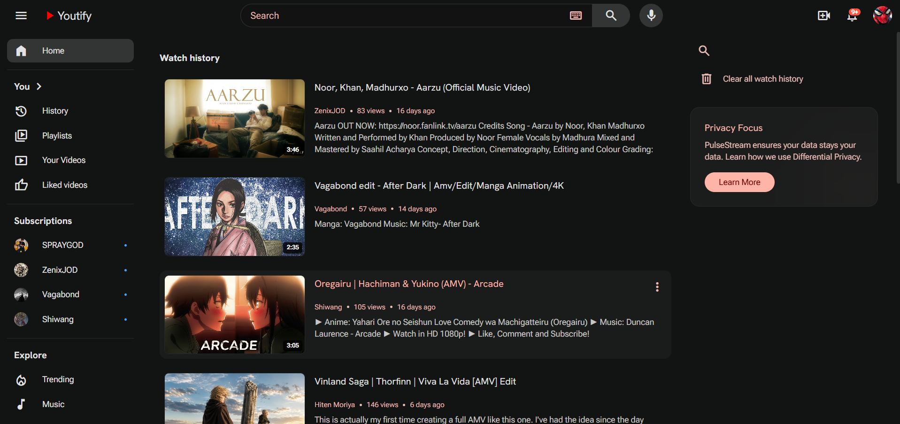

<div align="center">

# 🎥 Youtify

### A Full Stack YouTube-inspired Video Streaming Platform built with the MERN Stack

<p>
Youtify is a modern video sharing platform where users can upload videos, create playlists, subscribe to creators, interact through comments, and manage their own channel with a clean and responsive interface.
</p>

<p>


</p>

</div>

---

# 📖 About

Youtify is a full-stack MERN video streaming platform inspired by YouTube.

Users can create an account, upload videos, manage playlists, subscribe to channels, like videos and comments, reply to comments, manage their profile, and enjoy a smooth video watching experience.

The application follows a modern MERN architecture with secure JWT authentication, REST APIs, Cloudinary media storage, Redux Toolkit state management, protected routes, and a responsive UI.

---

# 🚀 Project Highlights

- Full Stack MERN Application
- Secure JWT Authentication with HTTP-only Cookies
- Cloudinary Media Uploads
- RESTful Backend APIs
- Redux Toolkit State Management
- Responsive User Interface
- Nested Comment Replies
- Video & Comment Like System
- Playlist Management
- Channel Subscription System
- Watch History
- Search Functionality

---

# ✨ Features

## 🔐 Authentication

- User Registration
- Secure Login
- JWT Authentication
- HTTP-only Cookies
- Protected Routes
- Logout

---

## 🎥 Videos

- Upload Videos
- Upload Video Thumbnails
- Edit Video Details
- Delete Videos
- Watch Videos
- Responsive Video Player
- View Counter

---

## 💬 Comments

- Add Comments
- Reply to Comments
- Like Comments
- Nested Comment Threads

---

## ❤️ Engagement

- Like Videos
- Liked Videos Page
- Subscribe / Unsubscribe Channels
- Watch History

---

## 👤 User Profile

- Update Avatar
- Update Cover Image
- Edit Profile Information
- Change Password

---

## 📺 Channel

- Channel Dashboard
- Subscriber Count
- Channel Videos
- Channel Playlists

---

## 📂 Playlists

- Create Playlist
- Edit Playlist
- Delete Playlist
- Add Videos to Playlist
- Remove Videos from Playlist

---

## 🔍 Discovery

- Search Videos
- Suggested Videos
- Responsive Homepage

---

## 🎨 UI Features

- Responsive Design
- Skeleton Loading
- Toast Notifications
- Empty States
- Sidebar Navigation
- Modern User Interface

---

# 📷 Screenshots

| Home | Watch |
|------|-------|
|  |  |

| Channel | Profile |
|---------|---------|
|  |  |

| Upload | Playlist |
|--------|----------|
|  |  |

| Search | Liked Videos |
|--------|--------------|
|  |  |

| History | Your Videos |
|--------|--------------|
|  |  |

---

# 🛠 Tech Stack

## Frontend

- React
- Redux Toolkit
- React Router DOM
- Tailwind CSS
- Axios
- React Hook Form
- Sonner

---

## Backend

- Node.js
- Express.js
- MongoDB
- Mongoose
- JWT
- Multer
- Cloudinary
- Cookie Parser

---

# 📂 Project Structure

```text
Youtify
│
├── backend
│   ├── src
│   ├── public
│   ├── package.json
│   └── .env.example
│
├── frontend
│   ├── src
│   ├── public
│   ├── package.json
│   └── .env.example
│
├── assets
│
└── README.md
```

---

# 🚀 Getting Started

## Clone Repository

```bash
git clone https://github.com/hitenDev11/youtify.git
```

---

## Install Dependencies

### Backend

```bash
cd backend
npm install
```

### Frontend

```bash
cd frontend
npm install
```

---

## Environment Variables

### Backend (.env)

```env
PORT=3000

MONGO_URL=your_mongodb_connection_string

ACCESS_TOKEN_SECRET=your_access_token_secret
ACCESS_TOKEN_VALID=1d

REFRESH_TOKEN_SECRET=your_refresh_token_secret
REFRESH_TOKEN_VALID=10d

CLOUDINARY_CLOUD_NAME=your_cloud_name
CLOUDINARY_API_KEY=your_api_key
CLOUDINARY_API_SECRET=your_api_secret

CORS_ORIGIN=http://localhost:5173

NODE_ENV=development
```

---

### Frontend (.env)

```env
VITE_API_URL=http://localhost:3000/api/v1
```

---

# ▶ Running the Project

### Backend

```bash
cd backend
npm run dev
```

### Frontend

```bash
cd frontend
npm run dev
```

---

# 📡 API Overview

## Authentication

- Signup
- Login
- Logout
- Refresh Token
- Get Current User

---

## Users

- Update Profile
- Update Avatar
- Update Cover Image
- Change Password
- Watch History

---

## Videos

- Upload Video
- Update Video
- Delete Video
- Get All Videos
- Watch Video

---

## Comments

- Add Comment
- Reply to Comment
- Update Comment
- Delete Comment
- Like Comment

---

## Playlists

- Create Playlist
- Update Playlist
- Delete Playlist
- Add Video
- Remove Video

---

## Likes

- Like Video
- Unlike Video
- Like Comment
- Unlike Comment
- Get Liked Videos

---

## Subscriptions

- Subscribe Channel
- Unsubscribe Channel
- Get Subscribers
- Get Subscribed Channels

---

# 💡 Key Learnings

Building Youtify helped me improve my understanding of:

- React Architecture
- Redux Toolkit
- React Router
- Authentication with JWT
- Cookie-based Authentication
- REST API Design
- Express.js
- MongoDB & Mongoose
- MongoDB Aggregation Pipeline
- File Uploads using Multer
- Cloudinary Integration
- Protected Routes
- Backend Architecture
- Error Handling
- Responsive UI Development

---

# 🚀 Future Improvements

- Notifications
- Live Streaming
- Video Categories
- Trending Videos
- Infinite Scroll
- Better Video Recommendations
- Real-time Chat

---

# 🤝 Contributing

Contributions are welcome!

Feel free to fork the repository, open an issue, or submit a pull request.

---

# 📄 License

This project is intended for educational purposes.

---

<div align="center">

## 👨‍💻 Author

**Hiten Moriya**

GitHub: https://github.com/hitenDev11

Made with ❤️ using the MERN Stack

</div>